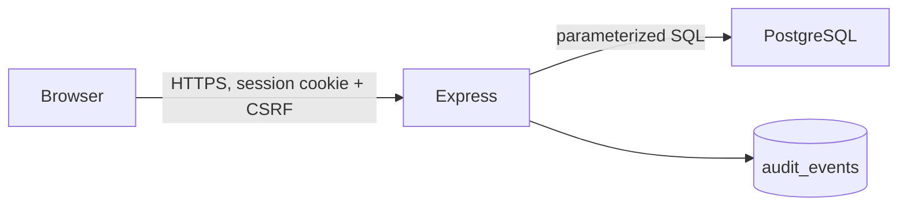

# Architecture

The static client and API share one origin. Trust boundaries are the browser, reverse proxy/TLS termination, application, and PostgreSQL. There is no cache, queue, worker, third-party identity provider, payment provider, or multi-tenant organization model.
